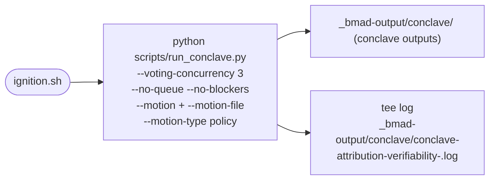
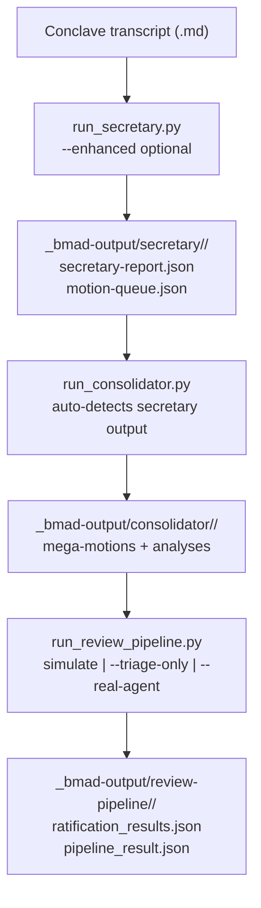
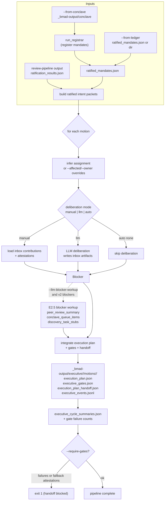
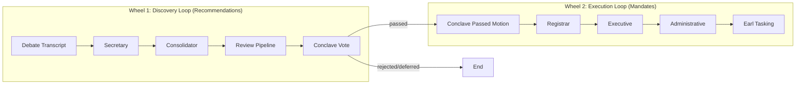
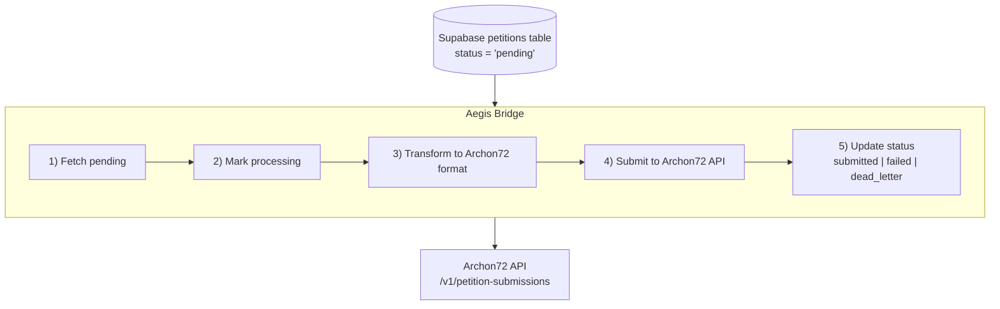

# Diagrams (Mermaid.js)

This file collects Mermaid diagrams documenting key flows.

## ignition.sh (Conclave runner)

## Discovery Loop: Secretary → Consolidator → Review

## Executive Pipeline (v2)

## Two Wheels Architecture (from docs/stages/run-pipeline.md)

## Aegis Bridge (Supabase → Archon72)

